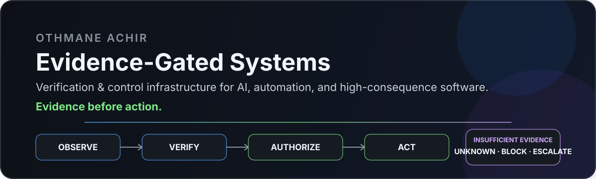

<div align="center">



<br/>

### Verification & control infrastructure for AI, automation, and high-consequence software

I build systems that decide **when there is enough evidence to act — and when the correct answer is UNKNOWN.**

[](https://github.com/achirothmane/workflow-failure-lab)
[](https://github.com/achirothmane/agent-action-guard)
[](https://github.com/achirothmane/postgres-change-safety)

</div>

---

## What I build

I build **verification and control systems for software that should not act on weak evidence**.

My current work focuses on:

**AI-agent control · CI reliability · causal verification · developer tooling · high-consequence automation**

I work primarily with:

**Python · GitHub Actions · PostgreSQL · CI/CD · AI/LLM systems**

The recurring engineering question behind my projects is:

> **What evidence must be established before this system is allowed to act?**

### Open to

Verification / reliability / developer-infrastructure work, applied AI systems, and selected technical collaborations where evidence, control, and auditability matter.

---

## Most relevant systems

<table>
<tr>
<td width="50%" valign="top">

### [CI Retry Gate](https://github.com/achirothmane/workflow-failure-lab)

**Problem**  
CI systems often retry failures without knowing whether retrying is actually justified.

**Built**  
An evidence-gated decision layer that checks provenance, causal evidence, side effects, and retry limits before granting rerun authority.

**Why it matters**  
Fewer blind reruns, clearer failure handling, and auditable retry decisions.

`failure → evidence → decision → retry / block`

</td>
<td width="50%" valign="top">

### [Consequence Boundary Completeness](https://github.com/achirothmane/agent-action-guard)

**Problem**  
An AI agent may reach a real-world consequence through a path that bypasses the approval boundary intended to control it.

**Built**  
A scanner and runtime witness for modeled consequence paths, expected boundaries, bypasses, and unresolved evidence.

**Why it matters**  
Authorization controls are only useful if alternate paths cannot silently route around them.

`agent → path analysis → boundary → counterexample / covered / unknown`

</td>
</tr>

<tr>
<td width="50%" valign="top">

### [PostgreSQL Change Safety](https://github.com/achirothmane/postgres-change-safety)

**Problem**  
A workload regression after a PostgreSQL change is easy to observe and easy to misattribute.

**Built**  
Comparable workload windows, stable SQL fingerprints, controlled causal experiments, plan-variant analysis, and explicit confounder handling.

**Why it matters**  
The tool separates “a regression happened” from “we have enough evidence to say why.”

`before/after → regression → causal isolation → evidence strength`

</td>
<td width="50%" valign="top">

### [Legal Authority Diff](https://github.com/achirothmane/legal-authority-diff)

**Problem**  
A legal-AI answer can still look plausible while its citations, authority strength, treatment, or claim support become weaker.

**Built**  
Differential regression testing across baseline and candidate outputs, with explicit `UNKNOWN` and `WORLD_CHANGE` states.

**Why it matters**  
A citation existing is not the same as the citation being sufficient support for the claim.

`baseline → candidate → authority diff → block / unchanged / world change`

</td>
</tr>
</table>

### Also building

**[Private Code Modernization Factory](https://github.com/achirothmane/private-code-modernization-factory)** — evidence-first modernization analysis with constrained patch proposals, differential verification, and escalation when automation has not earned authority.

---

## Technical focus

<div align="center">


</div>

---

## The engineering thesis

A recurring failure pattern appears across AI agents, CI systems, databases, legal AI, and software automation:

> **Plausibility is not authority. A system should act only when the evidence required for that action has actually been established.**

The architecture I keep returning to is:

```text
Input / Event / Proposed Action
              │
              ▼
      Evidence Collection
              │
              ▼
         Verification
        ┌─────┴─────┐
        │           │
   sufficient   insufficient
        │           │
        ▼           ▼
Authority/Policy   UNKNOWN
        │        BLOCK / ESCALATE
        ▼
    Decision Gate
     ┌───┼───┐
     ▼   ▼   ▼
   ALLOW BLOCK HUMAN
        │
        ▼
     Execution
        │
        ▼
 Outcome Verification
        │
        ▼
   Audit / Replay
```

---

## Design rules I care about

<table>
<tr>
<td width="33%" valign="top"><b>Explicit uncertainty</b><br/><br/><code>UNKNOWN</code> is a valid engineering outcome. It is safer than inventing certainty from weak evidence.</td>
<td width="33%" valign="top"><b>Fail closed</b><br/><br/>High-consequence actions do not silently inherit permission when evidence is incomplete.</td>
<td width="33%" valign="top"><b>Read-only first</b><br/><br/>Observe and prove value before enabling mutation, reruns, quarantine, merge, deploy, or other write authority.</td>
</tr>
<tr>
<td width="33%" valign="top"><b>Differential verification</b><br/><br/>Prefer controlled before/after evidence over plausible explanations.</td>
<td width="33%" valign="top"><b>Causal isolation</b><br/><br/>When attribution matters, test competing explanations instead of treating correlation as cause.</td>
<td width="33%" valign="top"><b>Audit & replay</b><br/><br/>Important decisions should retain enough evidence to inspect and reproduce how authority was granted.</td>
</tr>
</table>


---

## Connect

<div align="center">

[](https://www.linkedin.com/in/othmane-achir-2733a540b/)

**Open to selected technical collaborations in verification, reliability, developer infrastructure, and applied AI systems.**

</div>
---

<div align="center">

### Evidence before action.

**Build → test → falsify → strengthen the evidence → automate only what has earned authority.**

<sub>Independent tools first. Shared platform only when repeated real-world usage proves the same primitives belong together.</sub>

</div>
