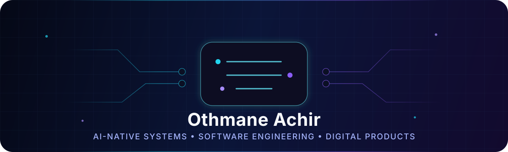

<div align="center">



<br/>


<br/>

<a href="https://www.linkedin.com/in/othmane-achir-2733a540b/">
  
</a>


</div>

---

## ◈ Build trajectory

```text
Software Engineering
        │
        ▼
Backend · APIs · Data · Reliability
        │
        ▼
AI-Native Systems · Agents · Automation
        │
        ▼
Product Engineering
        │
        ▼
Useful Digital Products
        │
        ▼
Measure → Learn → Improve → Ship again
```

I use GitHub as a **working engineering portfolio**: real systems, real experiments, real failures, and progressively stronger products.

My direction is deliberately broader than one niche:

**software engineering + AI-native systems + developer tools + technical product building**

---

## ◈ Current learning stack

<table>
<tr>
<td width="33%" valign="top">

### ⚙️ Software Engineering

`Python` `Go` `Rust` `TypeScript` `SQL`

APIs · PostgreSQL · Testing · Git · CI/CD · Backend architecture

**Goal:** build maintainable systems with clear contracts and production-oriented behavior.

</td>
<td width="33%" valign="top">

### ✦ AI-Native Systems

`LLM APIs` `Tool Calling` `Agents`

RAG · evaluation · observability · agentic workflows · automation

**Goal:** treat AI as part of a real software system, not as an isolated prompt.

</td>
<td width="33%" valign="top">

### ◉ Product Engineering

`UX` `Onboarding` `Measurement`

Distribution · retention · pricing · packaging · product economics

**Goal:** turn engineering capability into products people can understand and use.

</td>
</tr>
</table>

### ◇ Formal methods & systems reasoning

`TLA+` · state machines · invariants · concurrency · failure modeling

I use formal methods as an **engineering discipline for understanding complex systems**, especially distributed state, concurrency, and failure behavior — not as the identity of the portfolio.

---

## ◈ Selected builds

<table>
<tr>
<td width="50%" valign="top">

### [Workflow Failure Lab](https://github.com/achirothmane/workflow-failure-lab)

**CI / Developer Tools**

Experiments around failure analysis, retry behavior, CI reliability, and practical engineering automation.

`CI → diagnose → decide → improve`

</td>
<td width="50%" valign="top">

### [PostgreSQL Change Safety](https://github.com/achirothmane/postgres-change-safety)

**Databases / Reliability**

Measures regressions around PostgreSQL changes and tests stronger ways to explain what actually changed.

`change → observe → compare → isolate`

</td>
</tr>

<tr>
<td width="50%" valign="top">

### [Conversion Truth Auditor](https://github.com/achirothmane/conversion-truth-auditor)

**Product / Analytics**

Explores whether reported conversion reflects the real customer journey and whether measurement can support product decisions.

`journey → signal → verify → decision`

</td>
<td width="50%" valign="top">

### [Private Code Modernization Factory](https://github.com/achirothmane/private-code-modernization-factory)

**AI + Software Engineering**

Uses AI in code modernization while keeping testing and engineering verification inside the implementation loop.

`legacy → analyze → change → verify`

</td>
</tr>

<tr>
<td width="50%" valign="top">

### [Firebase Auth Email Canary](https://github.com/achirothmane/firebase-auth-email-canary)

**Cloud / Reliability**

Detects failures in authentication-email delivery flows.

`auth event → delivery path → signal`

</td>
<td width="50%" valign="top">

### [AI Deployer](https://github.com/achirothmane/ai-deployer)

**AI / Deployment**

Experiments around shipping and operating AI-enabled software.

`AI capability → deploy → operate → learn`

</td>
</tr>
</table>

---

## ◈ Technical constellation

<div align="center">


<br/><br/>


</div>

---

## ◈ Live GitHub signal

<div align="center">


<br/>


</div>

---

## ◈ Working philosophy

> **Build real things. Learn from the implementation. Measure what happens. Improve the product. Ship again.**

I prefer projects that force useful learning: APIs that must work, workflows that must survive failure, databases that must preserve state, AI features that must operate inside software, and products that must produce understandable outcomes.

<div align="center">

### BUILD → TEST → MEASURE → LEARN → IMPROVE → SHIP

<sub>Independent software and product work, documented through real repositories.</sub>

</div>
