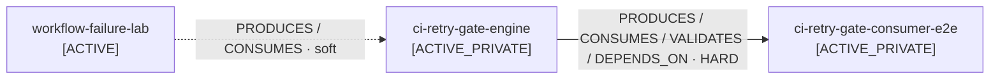

# Dependency Graph

> Generated snapshot from registered project records and verified contracts.
> Source of truth: `portfolio/index.yaml`, `portfolio/projects/*.yaml`, and `portfolio/contracts/*.yaml`.

**Project records:** 38  
**Verified contracts:** 2  
**Hard dependency contracts:** 1  
**Soft relationship contracts:** 1  
**Connected projects:** 3  
**Projects with no verified cross-project contract:** 35  
**Structural review:** 2026-10-06

## Verified graph

A solid arrow is backed by an explicit hard-dependency contract. A dashed arrow is a verified relationship but not a runtime requirement.

## Hard dependencies

| Dependent | Dependency | Contract |
|---|---|---|
| `ci-retry-gate-consumer-e2e` | `ci-retry-gate-engine` | `ci-retry-gate-engine--consumer-e2e` |

## Verified non-hard relationships

| Source | Target | Relations | Contract |
|---|---|---|---|
| `workflow-failure-lab` | `ci-retry-gate-engine` | PRODUCES, CONSUMES | `workflow-failure-lab--ci-retry-gate-engine` |

## Graph invariant

> A project-level hard dependency is valid only when a registered contract explicitly declares the same relationship with `hard_dependency: true`.

This prevents accidental coupling from becoming portfolio architecture.

## Generation status

The graph is currently a committed generated snapshot. The machine-readable JSON companion is `portfolio/dependency-graph.json`.

Automatic regeneration by repository script/CI is **PENDING** because the connected GitHub write surface rejected creation of the executable generator file on 2026-10-06. The YAML records and contracts remain the source of truth.
