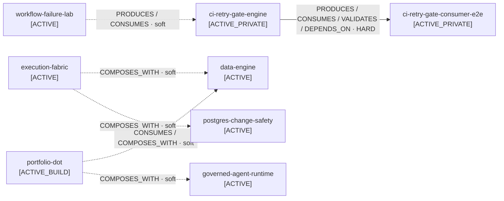

# Dependency Graph

> Generated from `portfolio/projects/*.yaml` and verified `portfolio/contracts/*.yaml`.
> Do not edit this file manually. Run `python portfolio/scripts/generate_dependency_graph.py`.

**Project records:** 40  
**Verified contracts:** 6  
**Hard dependency contracts:** 1  
**Soft relationship contracts:** 5  
**Connected projects:** 8  
**Projects with no verified cross-project contract:** 32  
**Structural review:** 2026-10-08

## Verified graph

A solid arrow means the relationship contains an explicit hard dependency. A dashed arrow is a verified relationship but not a runtime requirement.

## Hard dependencies

| Dependent | Dependency | Contract |
|---|---|---|
| `ci-retry-gate-consumer-e2e` | `ci-retry-gate-engine` | `ci-retry-gate-engine--consumer-e2e` |

## Verified non-hard relationships

| Source | Target | Relations | Contract |
|---|---|---|---|
| `execution-fabric` | `data-engine` | COMPOSES_WITH | `execution-fabric--data-engine` |
| `execution-fabric` | `postgres-change-safety` | COMPOSES_WITH | `execution-fabric--postgres-change-safety` |
| `portfolio-dot` | `data-engine` | CONSUMES, COMPOSES_WITH | `portfolio-dot--data-engine` |
| `portfolio-dot` | `governed-agent-runtime` | COMPOSES_WITH | `portfolio-dot--governed-agent-runtime` |
| `workflow-failure-lab` | `ci-retry-gate-engine` | PRODUCES, CONSUMES | `workflow-failure-lab--ci-retry-gate-engine` |

## Invariant

> A project-level `dependencies` entry is invalid unless a registered contract declares the same relationship with `hard_dependency: true`.

This keeps the graph evidence-backed and prevents accidental coupling from becoming architecture.
